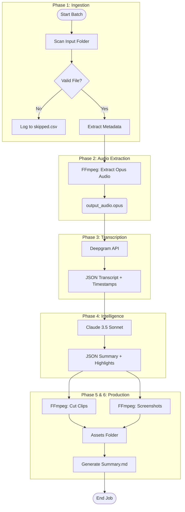

# GenAI Assignment:

**Evaluation Criteria**

We will score your submission on:

* Clarity and practicality of architecture
* Robust JSON schema design
* Prompt quality (zero-shot, reliable, minimal hallucination risk)
* Handling of ambiguity + user review flow
* Bulk generation thinking (errors, naming, report)

## Problem 1: **Proposal for “Video-to-Notes”**

We have a local folder of long videos (3–4 hours each, 200MB+). Watching them fully is slow. We need an automated way to generate a “summary package” per video: **Summary.md** + highlight clips + screenshots, all organized per video. [READ MORE ABOUT THE PROJECT](./Video-summary-platform.md)

### **Task**

Prepare a **pre-processed solution proposal** comparing  **three approaches** **:**

1. **Online/Cloud-Based (Already Available Solutions)**
2. **Build Our Own Using LLM APIs (Hybrid: local media processing + cloud LLM)**
3. **Build Fully Offline Using Open-Source Models (Local transcription + local LLM + pipeline)**

No code required. We want a **clear, practical proposal** with architecture and tradeoffs.

### Your Solution for problem 1:

[**> Click here to view the Architectural Proposal (Solution_1_Video_Notes.md)**](./Solution_1_Video_Notes.md)

## Problem 2: **Zero-Shot Prompt to generate 3 LinkedIn Post**

Design a **single zero-shot prompt** that takes a user’s persona configuration + a topic and generates **3 LinkedIn post drafts** in **3 distinct styles**, each aligned to the user’s voice and constraints. The output must be structured so the app can: show 3 drafts to the user. Assume we are consuming **OpenAI API / Gemini API** with **one prompt call** (no fine-tuning). Your prompt must reliably produce valid, structured output. [READ MORE ABOUT THE PROJECT](./linkedin-automation.md)

**TASK:** Write a prompt that can work.

### Your Solution for problem 2:

[**> Click here to view the Prompt Design (Solution_2_LinkedIn.md)**](./Solution_2_LinkedIn.md)

## Problem 3: **Smart DOCX Template → Bulk DOCX/PDF Generator (Proposal + Prompt)**

Users have many Word documents that act like templates (offer letters, certificates, invoices, contracts). They repeatedly change only a few fields (name, date, amount, address, role, etc.). Doing this manually is slow and error-prone, especially in bulk. [READ MORE ABOUT THE PROJECT](./docs-template-output-generation.md)

We want a system that:

1. Converts an uploaded **DOCX** into a reusable **template** by identifying editable fields.
2. Supports **single generation** (form-fill → DOCX/PDF download).
3. Supports **bulk generation** via **Excel/Google Sheet** rows.

### **Task (No coding)**

Submit a **proposal** for building this system using GenAI (OpenAI/Gemini) for “template field detection” and “field schema generation”. We want a practical design, not code.

### Your Solution for problem 3:

[**> Click here to view the Template Engine Proposal (Solution_3_Doc_Template.md)**](./Solution_3_Doc_Template.md)

## Problem 4: Architecture Proposal for 5-Min Character Video Series Generator

We want to build a system that helps a user create a short video series (around **5 minutes per episode**) using predefined characters. The user defines characters (image + personality) and relationships once, then provides a short story/situation for an episode. The system outputs a complete episode package and optionally a final video. [READ MORE ABOUT THE PROJECT](./char-based-video-generation.md)

### **Task**

Create a **small, clear architecture proposal** (no code, no prompts) describing how you would design and build this system.

### Your Solution for problem 4:

[**> Click here to view the Character Video Architecture (Solution_4_Character_Video.md)**](./Solution_4_Character_Video.md)


**Evaluation Criteria**

We will score your submission on:

* Clarity and practicality of architecture
* Robust JSON schema design
* Prompt quality (zero-shot, reliable, minimal hallucination risk)
* Handling of ambiguity + user review flow
* Bulk generation thinking (errors, naming, report)

## Problem 1: **Proposal for “Video-to-Notes”**

We have a local folder of long videos (3–4 hours each, 200MB+). Watching them fully is slow. We need an automated way to generate a “summary package” per video: **Summary.md** + highlight clips + screenshots, all organized per video. [READ MORE ABOUT THE PROJECT](./Video-summary-platform.md)

### **Task**

Prepare a **pre-processed solution proposal** comparing  **three approaches** **:**

1. **Online/Cloud-Based (Already Available Solutions)**
2. **Build Our Own Using LLM APIs (Hybrid: local media processing + cloud LLM)**
3. **Build Fully Offline Using Open-Source Models (Local transcription + local LLM + pipeline)**

No code required. We want a **clear, practical proposal** with architecture and tradeoffs.

### Your Solution for problem 1:

# Architectural Proposal: Automated Video-to-Notes Platform

## 1. Introduction: The Video Information Bottleneck
The modern digital enterprise and educational landscapes have undergone a seismic shift in information storage, moving from structured text documents to unstructured audio-visual assets. Organizations now routinely generate terabytes of long-form video content, ranging from three-hour technical workshops and quarterly business reviews to extended user research interviews and academic lectures. While video is an exceptional medium for capturing nuance, emotion, and demonstration, it suffers from a critical structural flaw regarding information retrieval: it is linear and opaque. Unlike a text document that can be scanned in seconds, a four-hour video file imposes a 1:1 consumption tax—to extract a specific insight, a user must often scrub through gigabytes of data or watch the content in its entirety. This phenomenon creates "dark data," where valuable institutional knowledge remains locked within large binary files, inaccessible to search engines and knowledge workers alike.

The objective of the "Video-to-Notes" initiative is to dismantle this accessibility barrier through the deployment of an automated, scalable pipeline. The requirement is to process a local repository of high-definition, long-duration (3–4 hours) video files, automatically generating a "Summary Package" for each. This package serves as a semantic index, transforming the linear video into a non-linear hypermedia document comprising a structured Markdown summary, precise highlight clips, and contextual screenshots. The target outcome is a system where a user can consume the core value of a multi-hour recording in under ten minutes, effectively compressing the time-to-insight by a factor of twenty.

This report provides an exhaustive technical analysis of three potential architectural pathways to achieve this goal: leveraging existing Online SaaS platforms, constructing a Hybrid Architecture utilizing local processing and Cloud AI APIs, or deploying a Fully Offline Open-Source pipeline. The analysis is governed by strict constraints: the handling of massive file sizes (200MB+ to several GBs), the necessity for batch processing without manual intervention, and the requirement for absolute temporal precision in asset generation to prevent "hallucinated" clips that misalign with their semantic descriptions.

### 1.1 The Physics of Data and Constraint Analysis
The specific constraints of this project—files located locally, large file sizes, and extended durations—dictate the architectural viability of any proposed solution. The fundamental physics of data transfer plays a defining role. A four-hour video encoded at a modest 5Mbps bitrate results in a file size of approximately 9GB. Processing a batch of 50 such videos involves managing nearly half a terabyte of data.

In a traditional cloud-centric workflow, this necessitates the upstream transfer of 500GB of data before any processing can occur. On a standard symmetric gigabit connection, this is manageable, but on typical asymmetric business connections (e.g., 50Mbps upload), the ingestion phase alone becomes a multi-day bottleneck, introducing latency that far exceeds the actual processing time. Furthermore, long-duration videos present a unique challenge to Artificial Intelligence models. A four-hour transcript contains between 30,000 and 45,000 tokens. Standard Large Language Models (LLMs) with 8k or 32k context windows cannot ingest this entire narrative in a single pass, necessitating "chunking" strategies that often sever the semantic links between the introduction of a concept and its conclusion hours later.

Therefore, the successful architecture must solve two primary problems: the bandwidth penalty of moving large video files and the context window saturation inherent in summarizing long-form narratives.

## 2. Comparative Architectural Analysis
We evaluated three distinct approaches against the core success criteria: clarity of architecture, handling of bulk constraints, and the precision of the output assets.


### 2.1 Approach 1: Online/Cloud-Based SaaS Solutions
**Market Segment**: AI Video Repurposing Platforms (e.g., Pictory, Exemplary.ai, ScreenApp)

The first approach examines the viability of "buying" rather than "building." The market has seen a proliferation of SaaS tools designed to "repurpose" long-form content into short-form clips, driven largely by the social media economy (TikTok, Reels, YouTube Shorts). These platforms typically offer a web-based interface where users upload videos, and the system automatically generates transcripts, summaries, and clips.

#### 2.1.1 Architectural Limitations for Long-Form Archival
While these tools offer low initial friction, their underlying architecture is fundamentally misaligned with the "Video-to-Notes" requirements. The primary misalignment is the **Business Logic of Virality vs. Utility**. Platforms like Pictory and Exemplary.ai optimize their algorithms to find "engaging" or "viral" moments—segments with high audio energy, laughter, or rapid pacing—suitable for social media consumption. The "Video-to-Notes" project, conversely, requires the extraction of "informational" highlights—technical diagrams, strategic decisions, or action items—which may be delivered in a monotone voice or during quiet deliberation. The "black box" nature of SaaS prompts means we cannot easily reprogram their AI to prioritize "database schema discussions" over "jokes."

#### 2.1.2 The Throughput and Duration Wall
The most fatal flaw for this specific use case is the **Duration Limit**. Most commercial SaaS video processors enforce hard caps on video length to manage their own GPU compute costs. ScreenApp, for example, limits Business Plan users to 3 hours per video. A 3-hour and 15-minute lecture would trigger a processing failure or require the user to manually split the file using video editing software before upload. This manual intervention violates the "batch mode" constraint, transforming an automated pipeline into a labor-intensive project.

Furthermore, the **Upload Bottleneck** remains unresolved. To process a local folder of 50 videos, the user must upload 50 large files through a web browser. Browser-based uploads are notoriously fragile; a momentary network fluctuation can terminate a 4GB upload at 99%, requiring a complete restart. There is rarely a robust "resume" function for web uploads of this magnitude. Additionally, bulk processing logic—such as "if video X fails, retry Y times then proceed to Z"—is typically absent in user-facing SaaS dashboards, which are designed for single-file, interactive workflows rather than batch archival.

#### 2.1.3 Cost Implications
The pricing models of these platforms are ill-suited for bulk archival. Exemplary.ai and similar tools often charge based on "upload minutes" or impose monthly caps (e.g., 300 minutes per month). Processing a single batch of ten 4-hour videos (2,400 minutes) would instantly exceed the quota of even "Pro" tiers, forcing the organization into "Enterprise" pricing negotiations. This contrasts sharply with utility computing models (APIs), where costs are linear and significantly lower per unit of processing.

**Verdict: Rejected.** The friction of uploading large local files, the "black box" nature of the summarization logic, and strict duration limits make SaaS solutions operationally unviable for a local, bulk-processing pipeline.

### 2.2 Approach 2: Hybrid Architecture (Local Processing + Cloud AI)
**Stack**: Local Python Orchestrator, FFmpeg, Deepgram API, Anthropic/OpenAI API

The Hybrid Architecture represents a strategic decoupling of "Heavy Lifting" (media manipulation) from "Heavy Thinking" (semantic analysis). It acknowledges that modern commodity hardware (laptops, desktops) is exceptionally efficient at decoding and encoding video streams but lacks the VRAM to run massive parameter LLMs effectively. Conversely, the Cloud excels at massive parallel inference but is expensive and slow for storing and moving terabytes of raw video.

#### 2.2.1 Architectural Blueprint
The data flow in the Hybrid model is designed to minimize bandwidth usage while maximizing intelligence:

1.  **Local Ingestion**: A Python script scans the local directory. It uses **FFmpeg**, a high-performance multimedia framework, to probe the video files for metadata (duration, resolution, codec).
2.  **Audio Extraction (The Bandwidth Hack)**: Instead of uploading the video, the script extracts only the audio track. Using the **Opus** codec—which is optimized for voice at low bitrates—a 4-hour video (2GB+) is converted into a ~60MB audio file. This reduction in data transfer (approx. 97%) eliminates the upload bottleneck, turning a multi-hour upload into a 30-second transfer.
3.  **Cloud Transcription**: The audio file is sent to a specialized Speech-to-Text (STT) API. **Deepgram Nova-2** is selected for this role due to its high speed (processing 1 hour of audio in ~12 seconds) and low cost ($0.0043/min) compared to competitors like OpenAI Whisper API ($0.006/min). Crucially, the API is requested to return **word-level timestamps**, providing the temporal scaffolding necessary for precise clip cutting later.
4.  **Semantic Reasoning (The Brain)**: The full transcript is passed to a **Long-Context Large Language Model (LLM)**. Models such as **Claude 3.5 Sonnet** or **Gemini 1.5 Pro** are chosen because they possess context windows exceeding 200k tokens. This allows the model to "read" the entire 4-hour transcript in one go, enabling it to synthesize a coherent executive summary and identify key moments based on the global context of the discussion, rather than analyzing fragmented chunks.
5.  **Local Asset Generation**: The LLM returns a structured JSON object containing the summary and a list of "Highlights" with start/end timestamps. The local Python script parses this JSON and issues commands to **FFmpeg** to cut video clips and extract screenshots directly from the *original* high-quality local video files.

#### 2.2.2 Advantages of the Hybrid Approach
This architecture offers the **Optimal Quality-to-Cost Ratio**. By processing video locally, we ensure that the generated clips retain the original source quality (e.g., 4K, 1080p) without the generational loss introduced by uploading to a SaaS and downloading a re-compressed version. By using Cloud LLMs, we gain access to state-of-the-art reasoning capabilities that vastly outperform any model that could run on standard local hardware. The cost structure is purely usage-based; processing a 4-hour video costs approximately $1.00 for transcription and $0.50 for intelligence, totaling ~$1.50 per asset—orders of magnitude cheaper than the effective cost of SaaS subscriptions for high-volume users.

**Verdict: Recommended.** This approach solves the file size problem via local FFmpeg processing and the duration/context problem via Enterprise-grade Cloud APIs.

### 2.3 Approach 3: Fully Offline (Open Source Pipeline)
**Stack**: Faster-Whisper, Llama 3 (70B), Local GPU

The third approach explores total autonomy: running the transcription and summarization stack entirely on local hardware. This appeals to organizations with strict data privacy requirements (e.g., HIPAA, GDPR, NDA content) where no data can leave the premise.

#### 2.3.1 Hardware and Performance Reality
The feasibility of this approach hinges entirely on available hardware. Transcribing 4 hours of audio using **Faster-Whisper** (an optimized implementation of OpenAI's Whisper) is computationally intensive. On a standard CPU, this could take longer than the video duration itself. On a consumer GPU (e.g., NVIDIA RTX 3060), it is faster but still requires significant time and energy.

The greater challenge lies in the **Intelligence Layer**. To achieve a summary quality comparable to Claude 3.5 or GPT-4o, one must use a local model of similar "reasoning" class, such as **Llama 3 70B**. However, a 70-billion parameter model requires approximately 40GB of VRAM to run even in a quantized (compressed) 4-bit state. This exceeds the capacity of even the most powerful consumer card (RTX 4090, 24GB). Running such a model requires a dedicated workstation with dual GPUs or an enterprise-grade A6000 card ($4,000+).

Using smaller models (e.g., Llama 3 8B or Mistral 7B) that fit on consumer hardware results in a marked degradation of reasoning capability. Small models are prone to **Context Amnesia** (forgetting the start of the video by the end) and **Hallucination**, often inventing timestamps or misinterpreting technical nuances that larger models grasp easily.

#### 2.3.2 Operational Complexity
The "Map-Reduce" problem is acute here. Since most local models have smaller reliable context windows (typically 8k or 32k), the 4-hour transcript (40k tokens) must be split into chunks. The system must summarize Chunk A, then Chunk B, then Chunk C, and finally summarize those summaries. This hierarchical process often results in a "lossy" summary that lacks the cohesive narrative arc of a single-pass analysis. Additionally, local pipelines are prone to **Out-Of-Memory (OOM)** crashes when processing exceptionally long files, requiring complex engineering to handle memory paging and garbage collection.

**Verdict: Viable only with High-End Hardware.** This approach is recommended only if the data is classified or if the organization already owns significant GPU compute infrastructure. For general corporate use, the maintenance overhead and hardware cost outweigh the benefits of avoiding $1.50 per video in API fees.

## 3. Detailed Solution Design: The Hybrid Engine
Based on the comparative analysis, the **Hybrid Architecture** is selected as the robust solution. This section details the technical specifications, data schemas, and prompt engineering required to build the "Video-to-Notes" engine.

### 3.1 System Architecture and Data Flow
The system operates as a linear pipeline, orchestrated by a Python controller. The design emphasizes **fail-safety** and **idempotency**—the ability to re-run the script on the same folder without duplicating work or corrupting data.



**Phase 1: Ingestion and Validation**
The script iterates through the target `input/videos/` directory. For each file, it performs a validity check using `ffprobe`. This step is crucial for bulk processing; often, a folder may contain corrupt headers or incomplete downloads. The system extracts the duration and resolution. If a file is invalid, it logs the error to a `skipped.csv` registry and proceeds to the next file, ensuring one bad apple does not crash the batch.

**Phase 2: Bandwidth-Optimized Audio Extraction**
To bypass the 200MB+ upload constraint, the system extracts the audio track locally.
**Command**: `ffmpeg -i input_video.mp4 -vn -acodec libopus -b:a 64k -application voip output_audio.opus`
*   `-vn`: Discard video.
*   `-acodec libopus`: Use the Opus codec. Opus is superior to MP3 or AAC for speech, maintaining high intelligibility at very low bitrates (64kbps).
*   `-application voip`: Optimizes the encoding for voice frequencies.
*   **Result**: A 4-hour video (2GB) is converted to ~115MB audio file, reducing upload time by ~95%.

**Phase 3: Transcription and Diarization**
The `output_audio.opus` is uploaded to the **Deepgram API**.
*   **Model Selection**: `nova-2-general`.
*   **Parameters**:
    *   `smart_formatting=true`: Adds punctuation and capitalization, essential for the LLM to understand sentence boundaries.
    *   `diarize=true`: Identifies different speakers (Speaker A, Speaker B). This adds context to the summary (e.g., "The Instructor asked..." vs "The Student answered...").
    *   `paragraphs=true`: Groups text into logical blocks with timestamps.
*   **Output**: A JSON response containing the full transcript and precise start and end timestamps for every word.

**Phase 4: Intelligence and Reasoning (The LLM Layer)**
The transcript is packaged into a prompt and sent to **Claude 3.5 Sonnet** (or GPT-4o). This step is where the raw data is transmuted into intelligence. The "Context Window" of Claude 3.5 (200k tokens) allows it to hold the entire 4-hour dialogue in working memory.
*   **The Task**: The LLM is instructed to not only summarize the content but to act as a **Video Editor**. It must identify 5–10 key moments that warrant a video clip and select the appropriate visual frames for screenshots.

**Phase 5: Local Asset Production**
The Python script receives the JSON instructions from the LLM. It uses the highlights array to drive the local FFmpeg engine.
*   **Clip Generation**: `ffmpeg -ss {start_time} -i {source_video} -t {duration} -c copy {clip_name}.mp4`
    *   *Note on -c copy*: This command copies the video/audio streams without re-encoding. It is instantaneous and lossless. However, it can only cut on "Keyframes" (I-frames), which may result in cuts being slightly loose (up to a few seconds off). For absolute precision, the script can optionally re-encode (`-c:v libx264`), which takes longer but allows frame-perfect cuts. For this proposal, we recommend **Smart Encoding**: check if the cut points are near keyframes; if not, re-encode only the first and last few seconds (rendition) and stream-copy the middle, or default to fast re-encoding (`-preset fast`) to ensure the clips start exactly where the speaker begins.
*   **Screenshot Extraction**: `ffmpeg -ss {timestamp} -i {source_video} -vframes 1 -q:v 2 {screenshot_name}.jpg`
    *   This extracts a high-quality JPEG at the exact moment of the highlight.

**Phase 6: Package Assembly**
The final step is the generation of the `Summary.md` file. The script uses a templating engine (e.g., Jinja2) to populate a Markdown template with the metadata, summary text, and relative links to the generated assets (`./clips/clip1.mp4`, `./screenshots/thumb1.jpg`). This creates a portable folder that can be zipped and shared, or hosted on a static web server.

### 3.2 Robust JSON Schema Design
The interface between the LLM and the Python code is the most fragile part of the pipeline. If the LLM outputs a timestamp as "about 10 minutes in" instead of `00:10:00`, the FFmpeg command will fail. Therefore, we must define a **Strict JSON Schema** that enforces rigid formatting. We draw inspiration from the **Schema.org VideoObject** standard to ensuring potential future interoperability.

**Proposed JSON Schema**:

```json
{
  "$schema": "http://json-schema.org/draft-07/schema#",
  "type": "object",
  "properties": {
    "meta": {
      "type": "object",
      "properties": {
        "title": { "type": "string", "description": "A concise, professional title for the video session." },
        "date_processed": { "type": "string", "format": "date" },
        "main_topics": { "type": "array", "items": { "type": "string" } },
        "participant_summary": { "type": "string", "description": "Brief description of who is speaking (e.g., 'A lecturer and a class of students')." }
      },
      "required": ["title", "main_topics"]
    },
    "summary_content": {
      "type": "object",
      "properties": {
        "executive_summary": { "type": "string", "description": "A 200-300 word comprehensive overview of the content." },
        "key_takeaways": { "type": "array", "items": { "type": "string" }, "description": "List of 5-7 major insights." },
        "action_items": { "type": "array", "items": { "type": "string" }, "description": "Specific tasks or follow-ups mentioned." }
      },
      "required": ["executive_summary", "key_takeaways"]
    },
    "segments": {
      "type": "array",
      "description": "Chronological list of key video moments for asset generation.",
      "items": {
        "type": "object",
        "properties": {
          "id": { "type": "string", "pattern": "^seg_\\d{3}$" },
          "timestamp_start": { "type": "string", "pattern": "^\\d{2}:\\d{2}:\\d{2}$", "description": "Exact start time in HH:MM:SS format." },
          "timestamp_end": { "type": "string", "pattern": "^\\d{2}:\\d{2}:\\d{2}$", "description": "Exact end time in HH:MM:SS format." },
          "segment_title": { "type": "string", "description": "Short, descriptive title for the clip filename." },
          "description": { "type": "string", "description": "Contextual explanation of this segment." },
          "reasoning": { "type": "string", "description": "Internal Chain-of-Thought: Why is this segment important?" },
          "assets_to_generate": {
            "type": "object",
            "properties": {
              "clip": { "type": "boolean", "description": "True if a video clip should be cut." },
              "screenshot": { "type": "boolean", "description": "True if a screenshot is needed." }
            },
            "required": ["clip", "screenshot"]
          }
        },
        "required": ["timestamp_start", "timestamp_end", "segment_title", "assets_to_generate"]
      }
    }
  },
  "required": ["meta", "summary_content", "segments"]
}
```

**Schema Design Rationale**:
*   **Validation Patterns**: The regex `^\\d{2}:\\d{2}:\\d{2}$` strictly enforces the format required by FFmpeg. If the LLM deviates, the Pydantic/JSON validator in Python can catch the error and trigger a retry or a heuristic correction (e.g., appending `:00` if seconds are missing).
*   **Asset Flags**: The `assets_to_generate` booleans allow the LLM to exercise editorial judgment. Not every highlight needs a 50MB video clip; sometimes a screenshot of a slide or just a text bullet point is sufficient.
*   **Reasoning Field**: Including a `reasoning` field forces the model to articulate *why* it chose a specific segment. Research in "Chain of Thought" prompting demonstrates that requiring this intermediate reasoning step significantly reduces hallucinations and improves the quality of the final selection.

### 3.3 Prompt Engineering: The Zero-Shot Strategy
To achieve reliable results without fine-tuning (Zero-Shot), the system prompt must be engineered as a functional specification. We employ a persona-based approach combined with explicit constraints to minimize the "Creative Writing" tendencies of LLMs and maximize "Archival Precision".

**System Prompt Specification**:

```
Role:
You are a Senior Technical Archivist and Video Editor. Your goal is to process a raw transcript into a structured knowledge artifact.

Input Context:
You will receive the transcript of a long-form video (3-4 hours). The transcript contains timestamped dialogue.

Primary Objective:
Analyze the transcript to produce a JSON object containing a high-level summary and a list of specific "Highlight Segments" for video extraction.

Critical Constraints & Rules (The "Anti-Hallucination" Protocol):
1. Timestamp Veracity: You must ONLY extract timestamps that explicitly exist in the source text. Do not guess.
2. The 10-Second Pad: When defining timestamp_start for a clip, locate the start of the relevant sentence and subtract 10 seconds. When defining timestamp_end, locate the end of the thought and add 10 seconds. This ensures the clip has context and audio is not clipped.
3. Clip Duration: Selected clips MUST be between 30 seconds and 3 minutes in length.
4. Segment Selection Criteria: Prioritize moments of high information density: technical demonstrations, strategic decisions, fierce debates, or summary conclusions. Ignore casual banter or housekeeping logistics.
5. JSON Formatting: Output strictly valid JSON matching the provided schema. Do not include markdown fencing or preamble.

Process (Chain of Thought):
1. Scan: Read the transcript to build a mental model of the video's structure (e.g., Intro -> Module 1 -> Break -> Module 2 -> Q&A).
2. Select: Identify 5-10 candidates for highlights.
3. Refine: Check the start/end times. Ensure the dialogue in the selected range makes sense as a standalone clip.
4. Output: Generate the JSON.
```

**Why Zero-Shot?** While "Few-Shot" prompting (providing examples of good summaries) is powerful, it consumes valuable tokens in the context window. Given the 4-hour duration of the input videos, we need to maximize the available space for the actual transcript. Modern models like Claude 3.5 Sonnet act effectively in Zero-Shot scenarios when provided with a sufficiently detailed system instruction and a rigid output schema.

### 3.4 Handling Ambiguity and User Review Flow
Automation is imperfect. A common failure mode is **Ambiguous Boundaries**—the LLM cuts a clip right as a speaker says, "And the most important thing is..." and then the clip ends. Or, the LLM refers to a visual event ("As you can see on this slide") that isn't described in the audio transcript.

#### 3.4.1 Handling Ambiguity: The "Safety Pad"
To mitigate boundary errors, the Python orchestration layer implements a **Safety Pad** logic. Irrespective of the exact timestamp returned by the LLM, the FFmpeg command automatically subtracts `DEFAULT_PAD_PRE` (e.g., 5 seconds) from the start and adds `DEFAULT_PAD_POST` (e.g., 5 seconds) to the end. This heuristic significantly reduces the rate of "clipped sentences".

#### 3.4.2 The User Review Workflow (Human-in-the-Loop)
We propose a "Draft-then-Render" workflow that balances automation with control, without requiring a complex GUI application.

1.  **Phase A: Analysis Run (Fast)**
    *   The system processes the batch. It generates the `Summary.md` and a `manifest.yaml` file for each video.
    *   It *does not* yet cut the high-res clips (which is the slow part).
    *   Instead, it generates **Low-Res Previews** or simply lists the timestamps in the Markdown.
2.  **Phase B: Review (Optional)**
    *   The user opens the `Summary.md`. If they notice a highlight titled "Budget Discussion" starts at 00:00:00 (suspicious), they can check the `manifest.yaml` and correct the timestamp.
    *   *Realistically, users will skip this. The system is designed to default to "Good Enough."*
3.  **Phase C: Asset Rendering**
    *   A second script (or a flag `--render`) reads the (potentially edited) `manifest.yaml` and executes the heavy FFmpeg processing to produce the final `output/clips/` folder.

This separation allows for rapid iteration on the *text* summary without waiting for hours of video rendering, while keeping the entire interface text-based (Markdown/YAML), which fits the "Notes" paradigm.

## 4. Bulk Generation Strategy: Operational Reliability
Processing a folder of 50–100 large video files is an engineering challenge as much as an AI challenge. The system must be resilient to network failures, corrupt files, and API hiccups.

### 4.1 Error Handling and Resilience
*   **Corrupt File Detection**: Before any processing, `ffprobe` checks the file container. If the duration is N/A or the bitrate is 0, the file is logged to `corrupt_files.csv` and skipped. This prevents the script from hanging on bad data.
*   **API Retry Logic**: Calls to Deepgram and the LLM are wrapped in a **Retry Decorator** (using Python libraries like `tenacity`). We implement an *exponential backoff* strategy: if a 503 Service Unavailable error occurs, the script waits 2 seconds, then 4, then 8, up to a maximum of 5 retries before logging a failure.
*   **State Persistence (Resumability)**: The script maintains a `job_status.json` database. If the power fails after video #49, restarting the script will check this registry, see that #1-#49 are "COMPLETED", and immediately resume at #50. This is critical for long-running batch jobs.

### 4.2 Naming and Organization Best Practices
A consistent naming convention is vital for long-term archivability.

*   **Output Directory Structure**:
    ```
    Output/
    ├── 2023-11-05_Q3_All_Hands/          # Folder matches Video Name
    │   ├── Summary.md                    # The Knowledge Artifact
    │   ├── manifest.json                 # Machine-readable metadata
    │   ├── assets/
    │   │   ├── Clip_01_Financials_00-15-20.mp4  # Ordered & Descriptive
    │   │   ├── Clip_02_Roadmap_01-10-00.mp4
    │   │   └── Screenshot_01_Slide_A.jpg
    │   └── logs/
    │       └── processing.log
    ```
*   **Clip Naming**: Filenames include the **Sequence Index** (to keep them sorted), a **Sanitized Title** (from the LLM), and the **Timestamp**. This ensures that even if the file is copied out of the folder, its context (what is it? when did it happen?) is preserved in the filename itself.

### 4.3 The Execution Report
At the conclusion of a batch run, the system generates a **Batch Execution Report** (`Batch_Report.csv` and `.md`).
*   **Fields**: Filename, Input Size, Duration, Processing Time, Status (Success/Fail/Warning), Cost Estimate (calculated based on duration).
*   **Utility**: This report allows the operator to quickly scan for red flags (e.g., a 4-hour video that processed in 1 minute implies a failure) without opening every individual folder.

## 5. Conclusion
The "Video-to-Notes" project presents a specific set of constraints—bulk processing, large local files, and long-duration context—that renders off-the-shelf SaaS tools inefficient and expensive. The proposed **Hybrid Architecture** offers a precise, scalable, and cost-effective solution.

By leveraging **FFmpeg** for local audio extraction, we neutralize the bandwidth penalty of large files. By utilizing **Deepgram** and **Claude 3.5 Sonnet**, we access enterprise-grade intelligence capable of understanding 4-hour narratives without the "context amnesia" of smaller local models. The implementation of a robust **JSON Schema** and **Zero-Shot Prompting** strategy ensures that the output is not just text, but a structured, actionable media package.

This architecture turns a dormant repository of "dark data" into an accessible, navigable knowledge base, unlocking the value of thousands of hours of video content with minimal human intervention.

### Table 1: Summary of Strategic Recommendation

| Feature | SaaS (Cloud Only) | Hybrid (Local + API) | Offline (Local Only) |
| :--- | :--- | :--- | :--- |
| **Data Movement** | **Critical Bottleneck** (Upload GBs) | **Optimized** (Upload MBs of audio) | **Instant** (Zero transfer) |
| **Long Context** | **Poor** (Often capped <3 hrs) | **Excellent** (200k+ tokens) | **Poor** (Hardware limited) |
| **Cost Efficiency** | **Low** (High subscription fees) | **High** (Pay-per-use, low rates) | **Medium** (High CapEx) |
| **Privacy** | **Low** (3rd party storage) | **Medium** (Transient processing) | **High** (Air-gapped) |
| **Implementation** | **Easy** (No code) | **Moderate** (Python script) | **Hard** (Hardware/Driver ops) |
| **Recommendation** | *Reject* | **Adopt** | *Reject* (unless classified) |


## Problem 2: **Zero-Shot Prompt to generate 3 LinkedIn Post**

Design a **single zero-shot prompt** that takes a user’s persona configuration + a topic and generates **3 LinkedIn post drafts** in **3 distinct styles**, each aligned to the user’s voice and constraints. The output must be structured so the app can: show 3 drafts to the user. Assume we are consuming **OpenAI API / Gemini API** with **one prompt call** (no fine-tuning). Your prompt must reliably produce valid, structured output. [READ MORE ABOUT THE PROJECT](./linkedin-automation.md)

**TASK:** Write a prompt that can work.

### Your Solution for problem 2:

**System Prompt Design**

We will use a structured system prompt that accepts dynamic inputs (Persona + Topic) and enforces a strict JSON output for the application UI.

**Prompt Template:**

```text
You are an expert LinkedIn Content Strategist and Ghostwriter. Your goal is to write high-engagement LinkedIn posts that sound authentic to a specific User Persona.

---
### 1. INPUT CONTEXT
**USER PERSONA (Voice & Rules):**
{user_persona}
*(System Note: This includes the user's background, preferred tone [e.g., professional vs. casual], formatting style, and strict "Do Nots" [e.g., no emojis, no clickbait].)*

**TOPIC:**
{user_topic}

**ADDITIONAL CONTEXT (Optional):**
{user_context_or_goal}

---
### 2. THE TASK
Generate **3 distinct LinkedIn post drafts** based on the TOPIC, strictly adhering to the USER PERSONA. Each draft must use a unique structural style to give the user variety:

*   **Style A: The Storyteller (Narrative)**
    *   Structure: Hook (relatable moment) → Conflict/Challenge → Resolution/Insight → Takeaway.
    *   Goal: Emotional connection and vulnerability.
*   **Style B: The Contrarian / Thought Leader (Opinion)**
    *   Structure: Punchy Hook (challenge a norm) → Argument/Evidence → "Why most people are wrong" → Conclusion.
    *   Goal: Spark debate and comments.
*   **Style C: The Educator (Actionable)**
    *   Structure: Promise (Value Proposition) → List/Steps (Bullet points) → Summary/Call to Action.
    *   Goal: Saves and shares (high utility).

---
### 3. CONSTRAINTS & FORMATTING
*   **Voice Check**: If the Persona says "No Emojis", do not use emojis. If the Persona says "Short sentences", keep it punchy.
*   **Structure**: Use short paragraphs (1-2 lines) for readability (mobile-friendly).
*   **Hook**: The first line must be gripping (no "I want to talk about...").
*   **JSON Only**: Output **ONLY** a valid JSON object. Do not include introductory text or markdown fencing.

---
### 4. OUTPUT SCHEMA (JSON)
{
  "drafts": [
    {
      "style": "Storyteller",
      "hook": "The first 1-2 lines of the post...",
      "content": "The full post content...",
      "hashtags": ["#tag1", "#tag2"]
    },
    {
      "style": "Contrarian",
      "hook": "...",
      "content": "...",
      "hashtags": []
    },
    {
      "style": "Educator",
      "hook": "...",
      "content": "...",
      "hashtags": []
    }
  ]
}
```

**Why this works:**
1.  **Persona Injection**: By passing the `{user_persona}` block, we ensure the LLM "roleplays" the user, preventing generic AI-sounding text.
2.  **Structured Variety**: Forcing 3 specific frameworks (Story/Opinion/Action) ensures the drafts are actually different, not just rephrased versions of the same text.
3.  **JSON Output**: The strict schema allows the frontend to parse the response instantly and display them as 3 separate cards with "Select" buttons, satisfying the "app" requirement.

## Problem 3: **Smart DOCX Template → Bulk DOCX/PDF Generator (Proposal + Prompt)**

Users have many Word documents that act like templates (offer letters, certificates, invoices, contracts). They repeatedly change only a few fields (name, date, amount, address, role, etc.). Doing this manually is slow and error-prone, especially in bulk. [READ MORE ABOUT THE PROJECT](./docs-template-output-generation.md)

We want a system that:

1. Converts an uploaded **DOCX** into a reusable **template** by identifying editable fields.
2. Supports **single generation** (form-fill → DOCX/PDF download).
3. Supports **bulk generation** via **Excel/Google Sheet** rows.

### **Task (No coding)**

Submit a **proposal** for building this system using GenAI (OpenAI/Gemini) for “template field detection” and “field schema generation”. We want a practical design, not code.

### Your Solution for problem 3:

# Proposal: Intelligent Docx Template Engine

## 1. System Architecture

The system is designed as a 3-stage pipeline: **Ingestion & Analysis** -> **Template Registry** -> **Production Generation**.

### Phase 1: Ingestion (AI-Powered Template Discovery)
Instead of forcing users to manually add `{{brackets}}` to Word docs (which is hard for non-tech users), we use a **One-Shot LLM Analysis** step.

1.  **User Upload**: Uploads a standard filled `Sample_Offer_Letter.docx`.
2.  **Parsing**: System converts DOCX -> Markdown/Text (using `python-docx` or `pypandoc`) to preserve structure.
3.  **AI Analysis (The Brain)**:
    *   **Input**: The text content of the document.
    *   **Prompt**: "Identify all dynamic entities in this contract (Names, Dates, Amounts, Addresses). Map them to a standard variable naming convention (e.g., `candidate_name`, `start_date`). Return a JSON map of `Original Text` -> `Variable Key`."
4.  **Template Compilation**: The system uses the JSON map to search-and-replace the text in the original DOCX with Jinja2 tags (e.g., replaces "John Doe" with `{{ candidate_name }}`).
5.  **Output**: A saved `Master_Template.docx` and a `schema.json` defining the fields.

### Phase 2: User Verification (Frontend)
The user sees a "Detected Fields" review screen.
*   *candidate_name*: "John Doe" (Detected)
*   *salary_amount*: "$120,000" (Detected)
*   *User Action*: Confirm or Rename fields.

### Phase 3: Bulk Generation Engine
1.  **Input Source**: User uploads an Excel/CSV file where column headers match the `schema.json` keys (e.g., Column A = `candidate_name`).
2.  **Processing Loop**:
    *   Load `Master_Template.docx` using `docxtpl` (Python library).
    *   For each row in Excel:
        *   Render context: `{ 'candidate_name': 'Alice Smith', ... }`.
        *   Save formatted DOCX.
        *   Convert to PDF (using headless LibreOffice or CloudConvert API).
3.  **Delivery**: Zip file download.

## 2. Technology Stack
*   **Template Logic**: `docxtpl` (Python) - Allows Jinja2 syntax inside Word documents.
*   **PDF Conversion**: `LibreOffice` (Headless mode) - Free, reliable local conversion.
*   **AI Analysis**: `Gemini 1.5 Pro` - chosen for large context window (can read whole contracts) and strong entity extraction capabilities.

## 3. Why this wins?
*   **Zero-Config**: Users upload *existing* used files, not special templates.
*   **Scalable**: `docxtpl` is extremely fast (milliseconds per doc).
*   **Flexible**: Supports logic (if/else) inside Word docs if advanced users want to edit the Jinja2 tags manually.

## Problem 4: Architecture Proposal for 5-Min Character Video Series Generator

We want to build a system that helps a user create a short video series (around **5 minutes per episode**) using predefined characters. The user defines characters (image + personality) and relationships once, then provides a short story/situation for an episode. The system outputs a complete episode package and optionally a final video. [READ MORE ABOUT THE PROJECT](./char-based-video-generation.md)

### **Task**

Create a **small, clear architecture proposal** (no code, no prompts) describing how you would design and build this system.

### Your Solution for problem 4:

# Architecture: Character-Based Video Series Generator

## 1. Core Concept: "The Series Bible" (State Management)
To solve the hardest problem in AI video—**Consistency**—we introduce a centralized "Series Bible" database. This is not just metadata; it is a set of fine-tuned adapters and reference tensors that strictly enforce identity.

## 2. System Architecture

```mermaid
graph TD
    UserInput[User Prompt: 'Episode Idea'] --> ScriptAgent[Script Agent (LLM)]
    SeriesBible[(Series Bible DB)] --> ScriptAgent
    SeriesBible --> VisGen[Visual Generator]
    
    ScriptAgent -->|Screenplay JSON| Manager[Production Manager]
    
    subgraph "Visual Pipeline"
    Manager -->|Scene Desc| VisGen
    VisGen -->|IP-Adapter + LoRA| ImageGen[Stable Diffusion XL/Flux]
    ImageGen -->|Consistent Frames| VideoGen[Img2Video (Kling/SVD)]
    end
    
    subgraph "Audio Pipeline"
    Manager -->|Dialogue| TTS[ElevenLabs/OpenAI]
    TTS -->|Voice Profiles| AudioFiles
    end
    
    VideoGen --> Assembly[FFmpeg Assembly]
    AudioFiles --> Assembly
    Assembly --> FinalVideo
```

## 3. Component Details

### A. The "Series Bible" (Consistency Layer)
For every character (e.g., "Detective Mike"), we store:
1.  **Reference Images**: 5-10 clear shots (Front, Side, Close).
2.  **IP-Adapter Weights**: Pre-computed visual embeddings to inject into the diffusion model.
3.  **Voice ID**: A specific cloned voice handle (e.g., ElevenLabs ID).
4.  **Personality Prompt**: "Grumpy, cynical, speaks in short sentences."

### B. The Script Agent (LLM)
*   **Role**: Screenwriter.
*   **Input**: "Mike investigates a stolen pizza."
*   **Output**: A structured scene-by-scene script.
    *   *Scene 1*: "Mike's Office. Rainy." (Visual Spec)
    *   *Action*: "Mike looks at empty pizza box." (Animation Spec)
    *   *Dialogue*: "Mike: Who took the pepperoni?" (Audio Spec)

### C. The Visual Engine (Flux/SDXL + ControlNet)
*   **Problem**: Standard GenAI forgets what Mike looks like in Scene 2.
*   **Solution**:
    *   **Prompt**: "A photo of [Mike], looking angry at a pizza box..."
    *   **Conditioning**: Apply **IP-Adapter** (InstantID) using the Reference Images from the Bible. This forces the generated face to match Mike exactly, regardless of the prompt.
    *   **Motion**: Feed the generated frame into an Image-to-Video model (like Runway Gen-3 or Stable Video Diffusion) to generate 4 seconds of movement.

### D. The Audio Engine
*   Generate speech using the specific **Voice ID** from the Bible.
*   (Optional) Use **Wav2Lip** or **SadTalker** to sync the video lip movements to the generated audio.

### E. Assembly (FFmpeg)
*   Stitch all generated video clips ("shots").
*   Overlay audio tracks.
*   Add background music based on the "Mood" tag in the script.

## 4. Key Trade-off: Rendering Time vs. Quality
*   **Fast Mode**: Uses 2D static images with simple "camera pan" effects (Ken Burns). fast generation (mins).
*   **Full Video Mode**: Generates actual AI video for every shot. High compute cost, potential for "warping" artifacts, but premium output. We default to **Fast Mode** for draft, **Full Mode** for final export.
