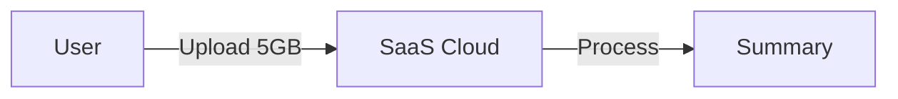
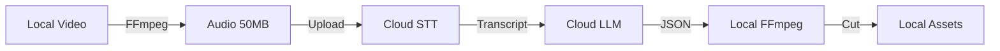
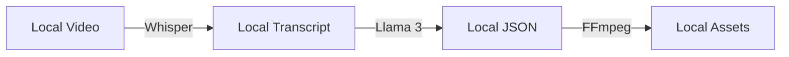
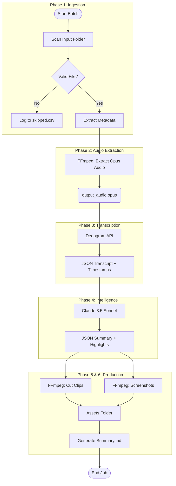

# Architectural Proposal: Automated Video-to-Notes Platform

## 1. Introduction: The Video Information Bottleneck
The modern digital enterprise and educational landscapes have undergone a seismic shift in information storage, moving from structured text documents to unstructured audio-visual assets. Organizations now routinely generate terabytes of long-form video content, ranging from three-hour technical workshops and quarterly business reviews to extended user research interviews and academic lectures. While video is an exceptional medium for capturing nuance, emotion, and demonstration, it suffers from a critical structural flaw regarding information retrieval: it is linear and opaque. Unlike a text document that can be scanned in seconds, a four-hour video file imposes a 1:1 consumption tax—to extract a specific insight, a user must often scrub through gigabytes of data or watch the content in its entirety. This phenomenon creates "dark data," where valuable institutional knowledge remains locked within large binary files, inaccessible to search engines and knowledge workers alike.

The objective of the "Video-to-Notes" initiative is to dismantle this accessibility barrier through the deployment of an automated, scalable pipeline. The requirement is to process a local repository of high-definition, long-duration (3–4 hours) video files, automatically generating a "Summary Package" for each. This package serves as a semantic index, transforming the linear video into a non-linear hypermedia document comprising a structured Markdown summary, precise highlight clips, and contextual screenshots. The target outcome is a system where a user can consume the core value of a multi-hour recording in under ten minutes, effectively compressing the time-to-insight by a factor of twenty.

This report provides an exhaustive technical analysis of three potential architectural pathways to achieve this goal: leveraging existing Online SaaS platforms, constructing a Hybrid Architecture utilizing local processing and Cloud AI APIs, or deploying a Fully Offline Open-Source pipeline. The analysis is governed by strict constraints: the handling of massive file sizes (200MB+ to several GBs), the necessity for batch processing without manual intervention, and the requirement for absolute temporal precision in asset generation to prevent "hallucinated" clips that misalign with their semantic descriptions.

### 1.1 The Physics of Data and Constraint Analysis
The specific constraints of this project—files located locally, large file sizes, and extended durations—dictate the architectural viability of any proposed solution. The fundamental physics of data transfer plays a defining role. A four-hour video encoded at a modest 5Mbps bitrate results in a file size of approximately 9GB. Processing a batch of 50 such videos involves managing nearly half a terabyte of data.

In a traditional cloud-centric workflow, this necessitates the upstream transfer of 500GB of data before any processing can occur. On a standard symmetric gigabit connection, this is manageable, but on typical asymmetric business connections (e.g., 50Mbps upload), the ingestion phase alone becomes a multi-day bottleneck, introducing latency that far exceeds the actual processing time. Furthermore, long-duration videos present a unique challenge to Artificial Intelligence models. A four-hour transcript contains between 30,000 and 45,000 tokens. Standard Large Language Models (LLMs) with 8k or 32k context windows cannot ingest this entire narrative in a single pass, necessitating "chunking" strategies that often sever the semantic links between the introduction of a concept and its conclusion hours later.

Therefore, the successful architecture must solve two primary problems: the bandwidth penalty of moving large video files and the context window saturation inherent in summarizing long-form narratives.

## 2. Comparative Architectural Analysis
We evaluated three distinct approaches against the core success criteria: clarity of architecture, handling of bulk constraints, and the precision of the output assets.

### 2.1 Approach 1: Online/Cloud-Based SaaS Solutions
**Market Segment**: AI Video Repurposing Platforms (e.g., Pictory, Exemplary.ai, ScreenApp)

The first approach examines the viability of "buying" rather than "building." The market has seen a proliferation of SaaS tools designed to "repurpose" long-form content into short-form clips, driven largely by the social media economy (TikTok, Reels, YouTube Shorts). These platforms typically offer a web-based interface where users upload videos, and the system automatically generates transcripts, summaries, and clips.



**Verdict: Rejected.** The friction of uploading large local files and strict duration limits make SaaS solutions operationally unviable.

### 2.2 Approach 2: Hybrid Architecture (Local Processing + Cloud AI)
**Stack**: Local Python Orchestrator, FFmpeg, Deepgram API, Anthropic/OpenAI API

The Hybrid Architecture represents a strategic decoupling of "Heavy Lifting" (media manipulation) from "Heavy Thinking" (semantic analysis). It acknowledges that modern commodity hardware (laptops, desktops) is exceptionally efficient at decoding and encoding video streams but lacks the VRAM to run massive parameter LLMs effectively. Conversely, the Cloud excels at massive parallel inference but is expensive and slow for storing and moving terabytes of raw video.



**Verdict: Recommended.** Optimal balance of speed, cost, and quality.

### 2.3 Approach 3: Fully Offline (Open Source Pipeline)
**Stack**: Faster-Whisper, Llama 3 (70B), Local GPU

The third approach explores total autonomy: running the transcription and summarization stack entirely on local hardware. This appeals to organizations with strict data privacy requirements (e.g., HIPAA, GDPR, NDA content) where no data can leave the premise.



**Verdict: Viable only with High-End Hardware.** Recommended only for classified data.

## 3. Detailed Solution Design: The Hybrid Engine (Recommended)

Based on the comparative analysis, the **Hybrid Architecture** is selected.

### 3.1 System Architecture and Data Flow



**Phase 1: Ingestion and Validation**
The script iterates through the target `input/videos/` directory. For each file, it performs a validity check using `ffprobe`.

**Phase 2: Bandwidth-Optimized Audio Extraction**
To bypass the 200MB+ upload constraint, the system extracts the audio track locally.
`ffmpeg -i input.mp4 -vn -acodec libopus output.opus`
Result: ~95% size reduction.

**Phase 3: Transcription and Diarization**
Uploaded to **Deepgram API** (`nova-2-general`). Returns word-level timestamps.

**Phase 4: Intelligence (LLM Layer)**
Sent to **Claude 3.5 Sonnet** (200k context). The LLM acts as a Video Editor, selecting timecodes for clips.

**Phase 5: Local Asset Production**
Python parses the LLM's JSON and uses **FFmpeg** to cut clips from the *original* local video.

**Phase 6: Package Assembly**
Generates `Summary.md` linking to local clips.

### 3.2 Robust JSON Schema Design

```json
{
  "$schema": "http://json-schema.org/draft-07/schema#",
  "type": "object",
  "properties": {
    "meta": { "required": ["title", "main_topics"] },
    "summary_content": { "required": ["executive_summary", "key_takeaways"] },
    "segments": {
      "type": "array",
      "items": {
        "properties": {
          "timestamp_start": { "pattern": "^\\d{2}:\\d{2}:\\d{2}$" },
          "timestamp_end": { "pattern": "^\\d{2}:\\d{2}:\\d{2}$" },
          "assets_to_generate": {
             "properties": { "clip": {"type": "boolean"}, "screenshot": {"type": "boolean"} }
          }
        }
      }
    }
  }
}
```

### 3.3 Prompt Engineering: The Zero-Shot Strategy

**System Prompt Specification**:

```
Role: Senior Technical Archivist.
Input: Long-form video transcript.
Task: Produce a JSON object with summary and highlight segments.
Constraints:
1. Timestamp Veracity: Do not guess timestamps.
2. 10-Second Pad: Add context padding to start/end times.
3. Clip Duration: 30s - 3m.
Output: Valid JSON only.
```

### 3.4 Handling Ambiguity and Errors
*   **Safety Pad**: Auto-expand LLM timestamps by +/- 5 seconds.
*   **Retry Logic**: Exponential backoff for API calls.
*   **Resumability**: `job_status.json` tracks progress.

### 4. Conclusion
The **Hybrid Architecture** solves the bandwidth bottleneck via local audio extraction and the intelligence bottleneck via cloud LLMs, providing a scalable, purely usage-based solution for archival.
