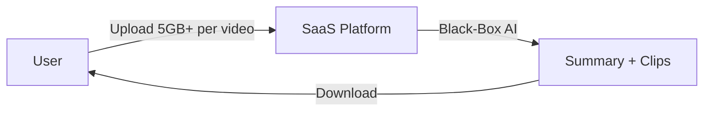
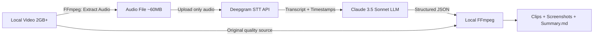
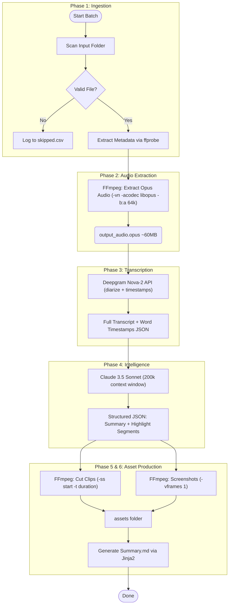
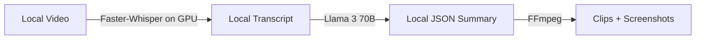

# Solution: Proposal for "Video-to-Notes" Platform

## The Problem

We have a local folder of long videos (3–4 hours each, 200MB+). We need an automated pipeline to generate a **Summary Package** per video:
- `Summary.md` — structured notes with key takeaways
- **Highlight clips** — short video segments of key moments
- **Screenshots** — frames from important slides/moments

---

## Approach Comparison

### Approach 1: Online/Cloud-Based SaaS (e.g., Pictory, ScreenApp, Exemplary.ai)



**How it works:** Upload videos to a third-party platform. The platform transcribes, summarizes, and generates clips automatically.

| Factor | Assessment |
|--------|-----------|
| File Size | [NO] Upload bottleneck — uploading 200MB–9GB per video is slow and fragile |
| Duration | [NO] Most platforms cap at 3 hours (ScreenApp Business Plan) — our 3–4hr videos may fail |
| Batch Processing | [NO] No bulk automation — manual upload per file via browser |
| Customization | [NO] Black-box AI optimized for "viral" clips, not technical/informational content |
| Cost | [NO] Subscription-based; 10 × 4hr videos = 2,400 min, exceeds most Pro plan limits |

**Verdict: REJECTED** — Upload friction, duration limits, and no batch control make this unworkable.

---

### Approach 2: Hybrid Architecture — Local Processing + Cloud AI -- RECOMMENDED



**How it works:**
1. **Local FFmpeg** extracts only the audio from each video (Opus codec, 64kbps -> ~60MB for 4hrs)
2. **Deepgram API** transcribes the audio with word-level timestamps (~12 sec per hour of audio)
3. **Claude 3.5 Sonnet** (200k token context) reads the full transcript and returns a JSON with summary + highlight timestamps
4. **Local FFmpeg** cuts clips and screenshots from the original high-quality video using those timestamps

**Full Pipeline (Detailed):**



| Factor | Assessment |
|--------|-----------|
| File Size | [YES] Only ~60MB audio uploaded (97% bandwidth reduction) |
| Duration | [YES] No limit — Claude 3.5 handles 200k tokens (full 4hr transcript) |
| Batch Processing | [YES] Python script with retry logic, state persistence, skips corrupt files |
| Customization | [YES] Full control over prompt — prioritize technical/informational content |
| Cost |  ~$1.50 per 4hr video (Deepgram $0.0043/min + Claude API) |

**Verdict: RECOMMENDED** — Solves the bandwidth problem (audio extraction) and the context problem (200k token LLM).

---

### Approach 3: Fully Offline — Open-Source Models (Faster-Whisper + Llama 3)



**How it works:** Run everything locally — Faster-Whisper for transcription, Llama 3 70B for summarization, FFmpeg for asset generation. Zero data leaves the machine.

| Factor | Assessment |
|--------|-----------|
| File Size | [YES] No upload needed |
| Duration | [WARN] Llama 3 70B needs 40GB VRAM (dual GPU or A6000 $4,000+) |
| Batch Processing | [WARN] Prone to OOM crashes on long files; requires chunking (lossy summaries) |
| Customization | [YES] Full control |
| Cost | [WARN] High CapEx (hardware); $0 per-run after setup |
| Privacy | [YES] Air-gapped — no data leaves premises |

**Verdict: CONDITIONAL -- Viable only if data is classified** — Requires enterprise GPU hardware. Smaller models (8B) hallucinate timestamps and lose context on 4hr videos.

---

## Strategic Recommendation Summary

| Feature | SaaS (Cloud Only) | **Hybrid (Local + API)** | Offline (Local Only) |
|---|---|---|---|
| Data Movement | [NO] Upload GBs | [YES] Upload MBs (audio only) | [YES] Zero transfer |
| Long Context (4hr) | [NO] Often capped <3hrs | [YES] 200k+ tokens | [WARN] Hardware limited |
| Cost Efficiency | [NO] High subscriptions |  ~$1.50/video | [WARN] High CapEx |
| Privacy | [NO] 3rd party storage | [WARN] Transient API calls | [YES] Air-gapped |
| Batch Automation | [NO] Manual uploads | [YES] Fully scripted | [WARN] OOM risk |
| **Recommendation** | **Reject** | ** Adopt** | **Reject (unless classified)** |

---

## JSON Schema (LLM Output Contract)

The LLM must return a strict JSON so FFmpeg commands can be generated reliably:

```json
{
  "meta": {
    "title": "Q3 All-Hands Meeting",
    "main_topics": ["Financials", "Roadmap", "Q&A"]
  },
  "summary_content": {
    "executive_summary": "200-300 word overview...",
    "key_takeaways": ["Insight 1", "Insight 2"],
    "action_items": ["Follow up on budget", "Schedule roadmap review"]
  },
  "segments": [
    {
      "id": "seg_001",
      "timestamp_start": "00:15:20",
      "timestamp_end": "00:18:45",
      "segment_title": "Q3_Financials_Overview",
      "description": "CFO presents Q3 revenue breakdown",
      "reasoning": "High information density — key financial decision point",
      "assets_to_generate": { "clip": true, "screenshot": false }
    }
  ]
}
```

**Key design decisions:**
- `timestamp_start/end` enforced as `HH:MM:SS` regex — FFmpeg rejects any other format
- `reasoning` field forces Chain-of-Thought, reducing hallucinated timestamps
- `assets_to_generate` flags let the LLM decide: not every moment needs a 50MB clip

---

## Zero-Shot Prompt (The LLM Instruction)

```
You are a Senior Technical Archivist. Process the transcript below into a structured JSON knowledge artifact.

RULES (Anti-Hallucination Protocol):
1. Only use timestamps that exist verbatim in the transcript. Never guess.
2. Add a 10-second pad: subtract 10s from start, add 10s to end of each clip.
3. Clips must be 30 seconds–3 minutes long.
4. Prioritize: technical demos, decisions, debates, conclusions. Skip banter/logistics.
5. Output ONLY valid JSON. No markdown fencing, no preamble.

PROCESS:
1. Scan the full transcript to map the video structure.
2. Identify 5–10 highlight candidates.
3. Verify timestamps exist in the source text.
4. Output the JSON.

[TRANSCRIPT BELOW]
```

**Why Zero-Shot?** Few-shot examples waste context window tokens. With a 4hr transcript (40k tokens), we need every token for the actual content. Claude 3.5 follows detailed zero-shot instructions reliably.

---

## Bulk Processing & Error Handling

**Resilience features:**
- `ffprobe` validates each file before processing — corrupt files logged to `skipped.csv`, batch continues
- API calls wrapped in exponential backoff retry (2s  4s  8s, max 5 retries)
- `job_status.json` tracks completed videos — if script crashes at video #49, it resumes at #50

**Output structure:**
```
Output/
 2024-11-05_Q3_All_Hands/
    Summary.md
    manifest.json
    assets/
        Clip_01_Financials_00-15-20.mp4
        Clip_02_Roadmap_01-10-00.mp4
        Screenshot_01_Slide_A.jpg
```

**Batch Report** generated at end: `Batch_Report.csv` with filename, duration, status, cost estimate per video.
