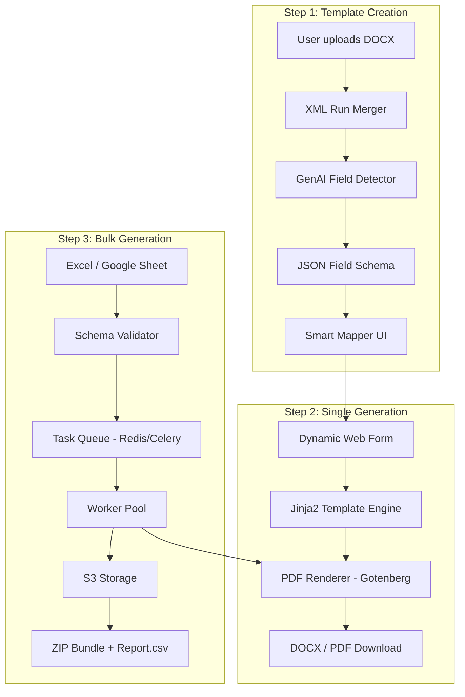
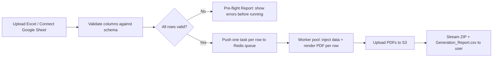

# Solution: Smart DOCX Template → Bulk DOCX/PDF Generator

## The Task (from GenAI.md)

Build a system that:
1. Converts an uploaded DOCX into a reusable template by **auto-detecting editable fields using GenAI**
2. Supports **single generation** (form-fill → DOCX/PDF output)
3. Supports **bulk generation** via Excel/Google Sheet rows

No code required — practical design using GenAI (OpenAI/Gemini) for field detection and schema generation.

---

## System Architecture



---

## The Core GenAI Role: Field Detection

The hardest part of this system is **automatically identifying which parts of a DOCX are dynamic fields**. This is where GenAI is used.

### The Problem: Split Runs in DOCX XML

When a user types `{{CandidateName}}` in Word, the internal XML often looks like this due to autocorrect/spell-check interruptions:

```xml
<w:p>
  <w:r><w:t>{{Candidate</w:t></w:r>
  <w:r><w:t>Na</w:t></w:r>
  <w:r><w:t>me}}</w:t></w:r>
</w:p>
```

A regex search for `{{CandidateName}}` fails. The system must first **merge split runs**, then scan.

### GenAI Field Detection Prompt

After XML cleaning, the plain text of the document is sent to the LLM:

```
ROLE
You are a document analysis engine. Analyze the following document text and identify all dynamic fields that should be replaced per-recipient.

RULES
1. Identify explicit placeholders: {{FieldName}}, [FieldName], <FieldName>, or ALL_CAPS_WORDS used as variables.
2. Identify implicit fields: dates, names, amounts, addresses that appear to be instance-specific.
3. For each field, infer its data type: String, Date, Currency, Email, Boolean, List.
4. Identify any repeating blocks (e.g., invoice line items) as Loop fields.
5. Identify any conditional blocks (e.g., "If EU client, include GDPR clause") as Boolean fields.
6. Output ONLY valid JSON. No explanation.

OUTPUT SCHEMA:
{
  "fields": [
    {
      "name": "string — camelCase field name",
      "label": "string — human readable label",
      "type": "String | Date | Currency | Email | Boolean | Number",
      "required": true,
      "detected_from": "string — the exact text that triggered detection",
      "description": "string — hint for the user filling the form"
    }
  ],
  "loops": [
    {
      "name": "string — loop variable name",
      "description": "string — what each row represents",
      "fields": ["field1", "field2"]
    }
  ],
  "conditionals": [
    {
      "name": "string — boolean flag name",
      "description": "string — what block this controls"
    }
  ]
}

DOCUMENT TEXT:
[DOCUMENT PLAIN TEXT HERE]
```

### Example Output

For an offer letter containing `Dear {{CandidateName}}`, `Start Date: [StartDate]`, and a salary table:

```json
{
  "fields": [
    { "name": "candidateName", "label": "Candidate Full Name", "type": "String", "required": true, "detected_from": "{{CandidateName}}", "description": "Enter the candidate's full legal name" },
    { "name": "startDate", "label": "Start Date", "type": "Date", "required": true, "detected_from": "[StartDate]", "description": "First day of employment" },
    { "name": "salary", "label": "Annual Salary", "type": "Currency", "required": true, "detected_from": "{{Salary}}", "description": "Gross annual compensation in USD" },
    { "name": "includeRelocation", "label": "Include Relocation Package?", "type": "Boolean", "required": false, "detected_from": "Relocation Allowance clause", "description": "Toggle to include/exclude relocation terms" }
  ],
  "loops": [],
  "conditionals": [
    { "name": "includeRelocation", "description": "Entire relocation package paragraph" }
  ]
}
```

---

## Template Engine: How Fields Get Injected

The DOCX template uses **Jinja2 syntax** (via `python-docx-template`):

| Use Case | Syntax in DOCX |
|---|---|
| Simple field | `{{ candidateName }}` |
| Date formatting | `{{ startDate \| date_format }}` |
| Currency formatting | `{{ salary \| currency }}` |
| Conditional block | `...` |
| Table row loop | `...` |

The system wraps the cleaned XML with these tags based on the GenAI-detected schema.

---

## Single Generation Flow

1. User uploads DOCX → GenAI detects fields → JSON schema saved
2. App renders a **dynamic web form** from the schema (date pickers for Date fields, currency inputs for Currency, toggles for Boolean)
3. User fills form → app injects data into template → sends to **Gotenberg** (Dockerized LibreOffice) for PDF conversion
4. User downloads DOCX + PDF

---

## Bulk Generation Flow



**Key design decisions:**
- **Pre-flight validation** before any generation starts — show all errors upfront, not mid-job
- **Fan-out architecture** — each row is an independent task; one failure doesn't kill the batch
- **Streaming ZIP** — PDFs piped directly from S3 into ZIP stream; server never holds full file in RAM
- **Generation_Report.csv** — lists every row with status (Success/Failed) and error reason for failed rows

---

## File Naming

User defines a naming pattern during template setup using the same field names:

```
Pattern:  {{ candidateName }}_OfferLetter_{{ startDate }}.pdf
Output:   John-Doe_OfferLetter_2024-03-15.pdf
```

**Sanitization:** `/`, `\`, `:`, `*` and other illegal characters in field values are replaced with `-` before filename construction. Duplicates get `_1`, `_2` suffixes.

---

## Technology Stack

| Layer | Choice | Why |
|---|---|---|
| Field Detection | OpenAI GPT-4o / Gemini 1.5 Pro | Best at inferring field types from context |
| Template Engine | `python-docx-template` (Jinja2) | Handles loops, conditionals natively in DOCX XML |
| Excel Parsing | `python-calamine` | Rust-based, ~10x faster than pandas for large files |
| PDF Rendering | Gotenberg (Dockerized LibreOffice) | Preserves fonts, tables, headers — no Word license needed |
| Task Queue | Redis + Celery | Industry standard for Python async bulk jobs |
| Storage | AWS S3 / MinIO | Lifecycle rules auto-delete temp files after 24hrs |
| Google Sheets | Sheets API v4 + OAuth 2.0 | Batch fetch entire range in one API call |

---

