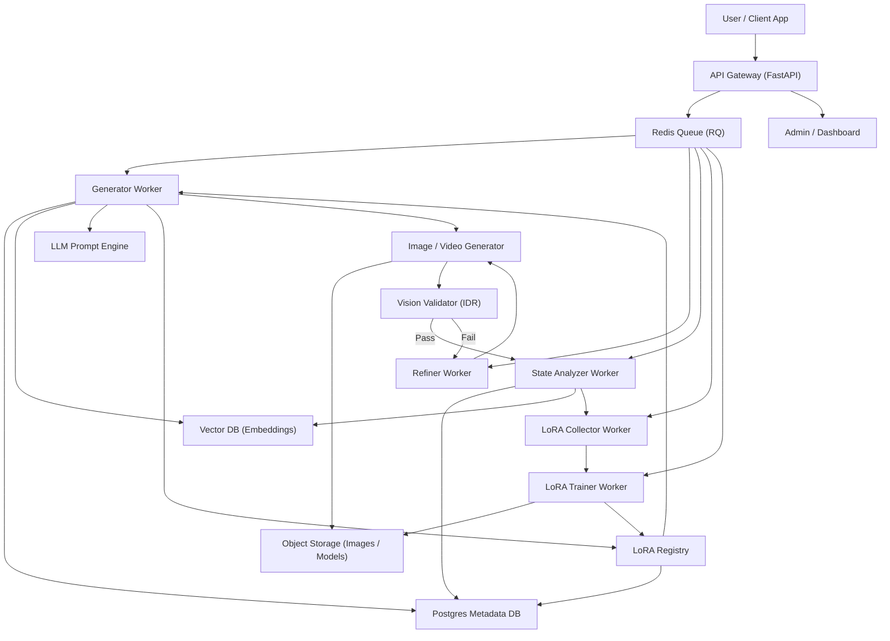
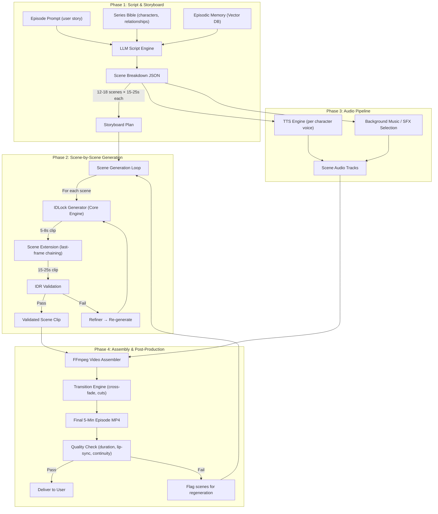

# Architecture: Character-Based Video Series Generator (5-Min Episodes)

> **Real-World Reference Implementation:**
> This architecture is based on **[LoraFrame (IDLock Engine)](https://github.com/Nithin9585/LoraFrame_)** — a project I built and presented at the **CENI AI Hackathon, Hyderabad** (Top 10 Finalist).
> LoraFrame is a persistent character memory & video generation system that combines episodic memory, LLM reasoning, and identity-preservation technology to create "permanent digital actors" that maintain visual consistency across generated images and videos.
> *(Note: This is my personal GitHub account — [Nithin9585](https://github.com/Nithin9585))*

---

## The Problem

We need to generate a **5-minute episode video** using AI-generated characters, but **no current AI video model can produce 5 minutes in one shot**. State-of-the-art models (Veo 3.1, Runway Gen-4, Kling 3.0) cap out at **5–15 seconds per clip**. The core challenge is:

1. **Generate many short clips** that are individually high-quality
2. **Maintain character identity** (face, clothing, style) across all clips
3. **Assemble clips** into a coherent 5-minute narrative with transitions, audio, and pacing
4. **Remember character history** across episodes so a series feels continuous

This proposal describes a system that solves all four problems.

---

## System Architecture (Core Engine)

The following diagram shows the **LoraFrame IDLock Engine** — the core system that powers character creation, identity-locked generation, memory, and self-healing refinement.



### Component Breakdown

| Component | Technology | Role |
|---|---|---|
| **API Gateway** | FastAPI (Python) | REST API for character creation, episode requests, job status |
| **Redis Queue** | Redis / RQ | Async job dispatch to workers; decouples API from heavy GPU tasks |
| **Generator Worker** | Veo 3.1 / Imagen 3 / Kling 3.0 | Produces identity-locked images/video clips per scene |
| **Refiner Worker** | InsightFace + Inpainting | Self-healing loop — if IDR detects identity drift, re-generates the face region |
| **State Analyzer** | LLM + Vector DB | Updates episodic memory after each generation (injuries, costume changes, mood) |
| **LoRA Collector/Trainer** | SDXL LoRA training pipeline | Collects validated images → fine-tunes a character-specific LoRA adapter |
| **LLM Prompt Engine** | Groq (Llama 3 70B) | Converts simple user prompts into rich, context-aware scene descriptions |
| **Vision Validator (IDR)** | InsightFace + ONNX Runtime | Compares generated face embeddings against canonical reference — reject if similarity < threshold |
| **LoRA Registry** | Postgres + Object Storage | Tracks which LoRA weights belong to which character; version-controlled |
| **Postgres** | PostgreSQL (SQLAlchemy) | Stores character metadata, episode scripts, scene timelines, generation logs |
| **Vector DB** | Pinecone / FAISS | Stores episodic memory embeddings for RAG-based character state retrieval |
| **Object Storage** | GCS / S3 | Stores generated images, video clips, LoRA model weights |

---

## Long Video Assembly Pipeline (5-Minute Episodes)

Since no single AI model can generate 5 minutes of video at once, we use a **Scene-by-Scene Generation + Assembly** pipeline. This is the key architectural addition that turns short AI clips into a full episode.



### How the Long Video Pipeline Works

#### Phase 1: Script & Storyboard Generation

The user submits a **short episode prompt** (e.g., *"Ava discovers the secret lab; her mentor warns her about the consequences"*). The LLM Script Engine:

1. **Loads the Series Bible** — character profiles, relationship maps, visual rules
2. **Retrieves episodic memory** via RAG — what happened in previous episodes (Vector DB)
3. **Generates a structured scene breakdown** — typically **12–18 scenes**, each 15–25 seconds long, totaling ~5 minutes

Example Scene Breakdown JSON:
```json
{
  "episode": {
    "title": "The Hidden Lab",
    "total_target_duration_sec": 300,
    "scenes": [
      {
        "scene_id": "sc_001",
        "description": "Establishing shot — Ava walks toward the abandoned building at dusk",
        "characters": ["ava"],
        "duration_sec": 20,
        "camera": "wide tracking shot, golden hour lighting",
        "dialogue": null,
        "narration": "Ava had always been curious. But tonight, curiosity felt dangerous.",
        "mood": "tense, mysterious"
      },
      {
        "scene_id": "sc_002",
        "description": "Close-up — Ava pushes open the heavy metal door, revealing blue lab lighting inside",
        "characters": ["ava"],
        "duration_sec": 15,
        "camera": "close-up face, rack focus to door interior",
        "dialogue": null,
        "narration": null,
        "mood": "suspenseful"
      }
    ]
  }
}
```

#### Phase 2: Scene-by-Scene Generation with Last-Frame Chaining

This is the critical technique for producing **long, continuous video from short AI clips**:

1. **Generate an initial 5–8 second clip** for each scene using the IDLock Generator (Veo 3.1 / Kling 3.0 API)
2. **Extract the last frame** of the generated clip
3. **Feed the last frame as a reference image** to the next generation call → this is **"Scene Extension" / "Last-Frame Chaining"**
4. **Repeat 2–3 times** per scene to extend each scene to 15–25 seconds
5. **IDR Validation** checks every clip — if the character's face drifts beyond the similarity threshold, the Refiner re-generates that clip

This approach is inspired by how **Veo 3.1's SceneBuilder** and **Kling 3.0's multi-shot generation** work:

| Technique | Source | Used For |
|---|---|---|
| **Last-Frame Chaining** | Veo 3.1 Scene Extension API | Extend a scene from 8s → 20s while maintaining visual continuity |
| **Multi-Shot Generation** | Kling 3.0 MVL Architecture | Generate 2–6 distinct scenes with character consistency in a single session |
| **Element Reference** | Kling 3.0 Character Reference 3.0 | Lock character identity across all shots using reference images |
| **IDR Self-Healing** | LoraFrame (InsightFace) | If face similarity drops below 0.85, regenerate that specific clip |

#### Phase 3: Audio Pipeline (Parallel)

While video is being generated, the audio pipeline runs in parallel:

- **TTS Engine** (ElevenLabs / Coqui XTTS) generates character-specific voice lines from the script
- **Music Selection** picks background tracks matching mood tags (tense, joyful, dramatic)
- **SFX Engine** adds ambient sounds (footsteps, door creaks, wind)

Each character has a **fixed voice profile** stored in the Series Bible — ensuring the same voice across episodes.

#### Phase 4: Assembly & Post-Production

```
FFmpeg Assembly Pipeline:
1. Concatenate scene clips in order       → raw_video.mp4
2. Add cross-fade transitions (0.5s)      → smooth_video.mp4
3. Mix dialogue audio with music/SFX      → mixed_audio.aac
4. Merge video + audio                    → episode_final.mp4
5. Validate total duration ≈ 300 seconds  → QC pass/fail
```

If QC fails (e.g., total duration is 247s instead of 300s), the system flags the shortest scenes and regenerates them with longer durations.

---

## Key System: Identity Persistence (IDLock)

The biggest challenge in AI video series is **keeping the same character looking the same** across hundreds of generated clips. LoraFrame solves this with a multi-layer identity system:

```
┌─────────────────────────────────────────────────────┐
│                  IDLock Stack                        │
├─────────────────────────────────────────────────────┤
│ Layer 1: Reference Images (canonical face + angles) │
│ Layer 2: InsightFace Embeddings (512-d face vector) │
│ Layer 3: LoRA Weights (fine-tuned on character)     │
│ Layer 4: Style Anchors (clothing, palette, props)   │
│ Layer 5: Episodic Memory (RAG — what happened)      │
└─────────────────────────────────────────────────────┘

Generation Flow:
User Prompt → LLM enriches with memory + style anchors
            → Generator uses reference images + LoRA weights
            → Output validated by InsightFace (cosine similarity ≥ 0.85)
            → PASS: save to memory  |  FAIL: refine and retry (max 3 loops)
```

---

## Episodic Memory: How Characters "Remember"

Each generation event creates a **memory record** stored in the Vector DB:

```json
{
  "character_id": "char_ava_001",
  "episode": 3,
  "scene": "sc_007",
  "state": {
    "clothing": "torn lab coat, no glasses",
    "injuries": "bandaged left hand",
    "mood": "determined but shaken",
    "location": "underground lab corridor"
  },
  "embedding": [0.012, -0.445, 0.893, ...]
}
```

Before generating a new scene, the **LLM Prompt Engine** runs a RAG query:
- *"What was Ava wearing in the most recent scene?"*
- Vector DB returns the latest state → LLM includes `"torn lab coat, bandaged left hand"` in the generation prompt
- This ensures **visual continuity within and across episodes**

---

## Technology Stack

### Backend (LoraFrame Engine)
| Layer | Technology |
|---|---|
| Framework | Python 3.10+, FastAPI |
| Database | PostgreSQL (SQLAlchemy) |
| Cache / Queue | Redis (RQ workers) |
| Vector DB | Pinecone / FAISS |
| LLM Inference | Groq (Llama 3 70B/8B) |
| Image/Video Gen | Google Veo 3.1, Imagen 3, Kling 3.0 (multi-provider) |
| Identity Lock | InsightFace, ONNX Runtime |
| LoRA Training | SDXL LoRA fine-tuning pipeline |
| Storage | Google Cloud Storage (GCS) / AWS S3 |

### Long Video Assembly Layer
| Component | Technology |
|---|---|
| Scene Extension | Veo 3.1 Scene Extension API (last-frame chaining) |
| Multi-Shot | Kling 3.0 Multi-Shot Generation |
| TTS | ElevenLabs API / Coqui XTTS (self-hosted) |
| Music/SFX | Mubert API / local library |
| Video Assembly | FFmpeg (concat, transitions, audio merge) |
| Quality Control | Duration validator + lip-sync checker |

### Frontend
| Layer | Technology |
|---|---|
| Framework | React.js |
| Language | JavaScript |

---

## Project Structure (LoraFrame Backend)

```
cineAI/
├── app/
│   ├── api/           # API Routes (characters, generate, video, episodes)
│   ├── core/          # Config, Database, Redis setup
│   ├── models/        # SQLAlchemy Database Models
│   ├── schemas/       # Pydantic Request/Response Models
│   ├── services/      # Core Logic (Groq, Gemini, MemoryEngine)
│   └── workers/       # Async Task Workers (generator, refiner, trainer, assembler)
├── assembly/
│   ├── script_engine/ # LLM-based scene breakdown generator
│   ├── chainer/       # Last-frame chaining / scene extension logic
│   ├── audio/         # TTS, music selection, SFX mixing
│   └── ffmpeg_ops/    # FFmpeg concat, transitions, final render
├── scripts/           # Utility scripts
├── tests/             # Pytest suite
├── uploads/           # Local storage for dev
├── .env.example       # Environment variable template
├── requirements.txt   # Python dependencies
└── README.md
```

---

## API Endpoints

| Method | Endpoint | Description |
|---|---|---|
| `POST` | `/api/v1/characters` | Create a new character from reference images |
| `POST` | `/api/v1/generate` | Generate a consistent image for a character |
| `POST` | `/api/v1/video/generate` | Generate a single video scene (short clip) |
| `POST` | `/api/v1/episodes/create` | Create a full 5-min episode from a story prompt |
| `GET` | `/api/v1/episodes/{episode_id}/status` | Poll episode assembly progress |
| `GET` | `/api/v1/episodes/{episode_id}/download` | Download the final episode MP4 + assets |
| `GET` | `/api/v1/jobs/{job_id}` | Check individual generation job status |

---

## Live Deployment

| Component | URL |
|---|---|
| **Frontend (Live App)** | [https://lore-frame-in.vercel.app](https://lore-frame-in.vercel.app) |
| **Backend API (GCP)** | [https://cineai-api-4sjsy6xola-uc.a.run.app/docs](https://cineai-api-4sjsy6xola-uc.a.run.app/docs) |

---

## Why This Architecture Works for 5-Minute Videos

| Challenge | Solution |
|---|---|
| AI models only generate 5–15s clips | **Scene-by-scene generation** with last-frame chaining extends each to 15–25s; 15 scenes = 5 min |
| Character faces change between clips | **IDLock (InsightFace + LoRA)** validates every frame; self-healing refiner fixes drift |
| Stories lack continuity across episodes | **Episodic Memory (RAG + Vector DB)** ensures characters "remember" past events and state |
| Audio doesn't match video | **Parallel audio pipeline** with per-character voice profiles + mood-tagged music |
| Quality varies across scenes | **Vision Validator + QC pipeline** — reject and regenerate below-threshold clips |
| No single tool does everything | **Modular, multi-provider architecture** — swap Veo for Kling or Runway per scene as needed |
